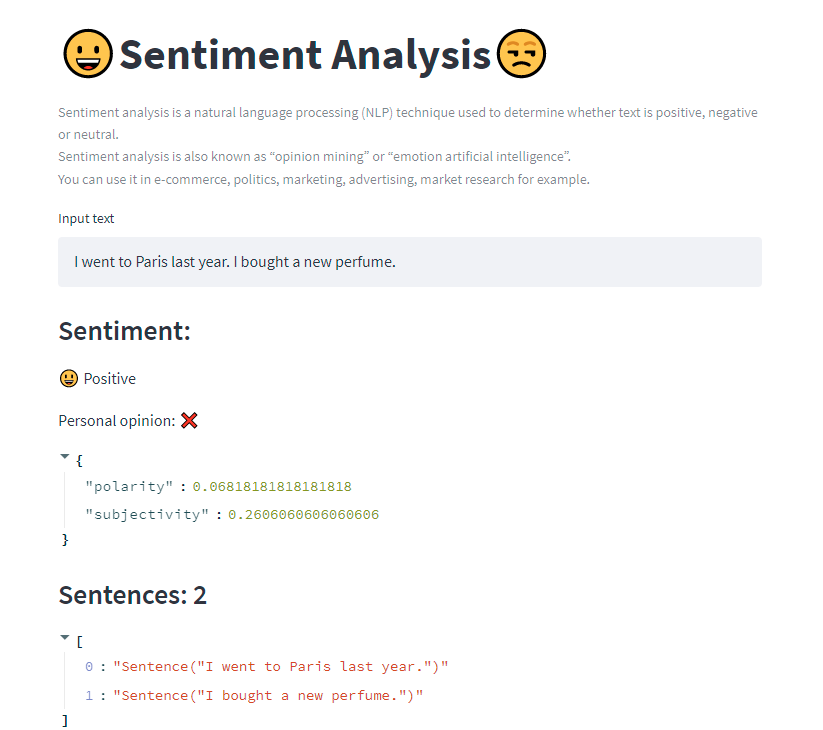

# :grinning:  Sentiment Analysis :unamused:

[]()
[](https://share.streamlit.io/ezeparziale/sentiment-analysis-streamlit/app/app_sentiment_analysis.py)

Sentiment analysis is a natural language processing (NLP) technique used to determine whether text is positive, negative or neutral.  
Sentiment analysis is also known as “opinion mining” or “emotion artificial intelligence”.  
You can use it in e-commerce, politics, marketing, advertising, market research for example.



## :floppy_disk: Install

```shell
python -m venv env
```

```shell
python -m pip install --upgrade pip
```

```shell
pip install -r requirements.txt
```

## :runner: Run

```shell
streamlit run app/app_map.py
```

```http
http://localhost:8501
```
